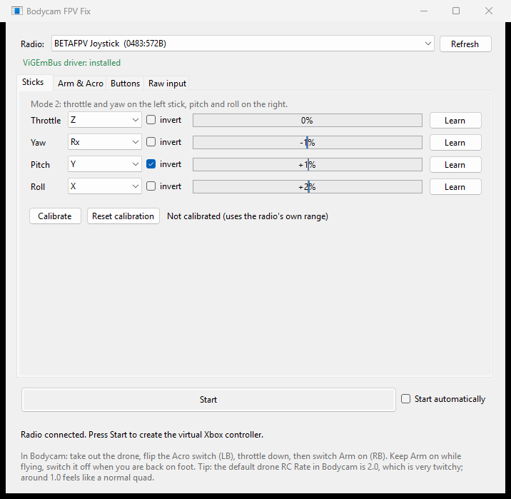
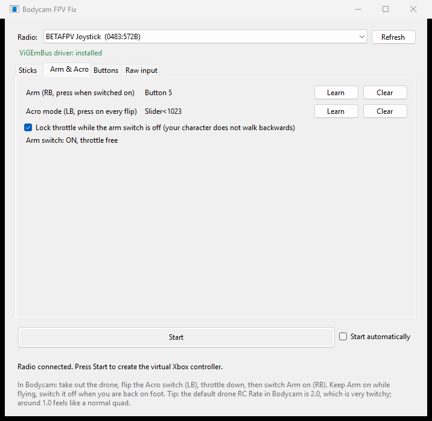
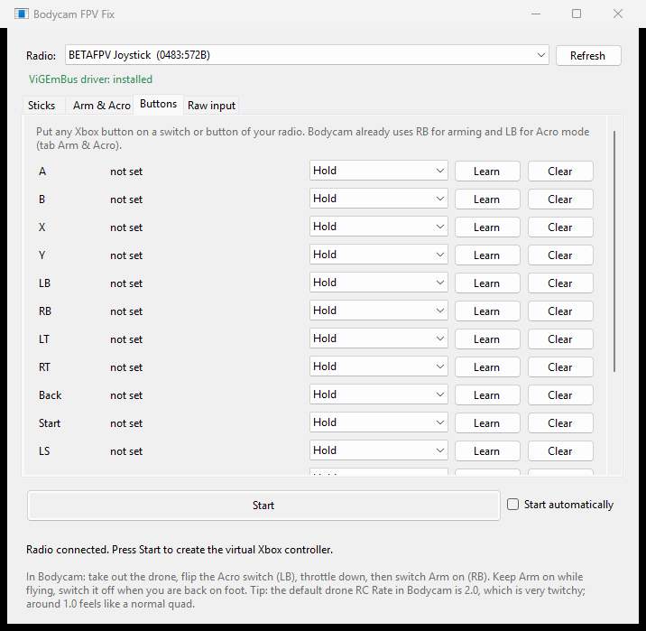
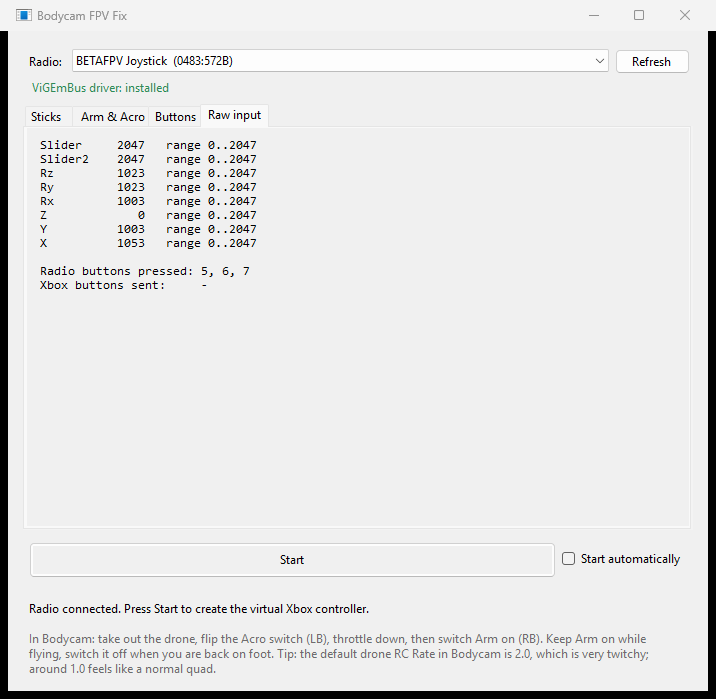

# Bodycam FPV Fix

Fly the FPV drone in **Bodycam** with a real RC radio instead of a gamepad.

Bodycam only understands Xbox controllers. Bodycam FPV Fix reads your radio over USB and turns it into a virtual Xbox controller with the stick layout that Bodycam's Acro mode expects: throttle and yaw on the left stick, pitch and roll on the right. Two switches on your radio arm the drone (RB) and toggle Acro mode (LB). Any other Xbox button can go on any switch or button of the radio, and a calibration wizard corrects off-center sticks and short stick travel.



| Arm & Acro | Buttons | Raw input |
|---|---|---|
|  |  |  |

**Guide:** [English](docs/GUIDE.md) · [Deutsch](docs/ANLEITUNG.md)

## Download

Get **`BodycamFpvFix.exe`** from the [latest release](https://github.com/lukas-Logikfabrik/bodycam-fpv-fix/releases/latest). It is a single file, needs no installation and runs on Windows 10 and 11.

## Quick start

1. Connect the radio by USB. If the radio asks for a USB mode, choose **USB Joystick (HID)**.
2. Start `BodycamFpvFix.exe`. On the first start it fetches the ViGEmBus driver by itself; confirm the Windows admin prompt once and click through the installer.
3. Tab **Sticks**: move the sticks, the bars should follow. If an axis is wrong or reversed, click **Learn** next to it and follow the blue prompt. Click **Calibrate** once and follow the two steps.
4. Tab **Arm & Acro**: click **Learn** next to Arm and flip your arm switch on. Do the same for Acro mode. (Preset for the BETAFPV LiteRadio: SA and the rightmost switch.)
5. Optional, tab **Buttons**: put more Xbox buttons on switches, for example to leave the drone.
6. Click **Start** and leave the window open while you play.

In Bodycam: take out the drone, flip the Acro switch, put the throttle down and switch Arm on. Keep Arm on while you fly and switch it off when you are back on foot.

> [!WARNING]
> **Keep the Arm switch OFF whenever you are on foot.** While Arm is on, the throttle stick goes to the game, and Bodycam reads it on foot as well: with the throttle down, your character walks backwards and keeps walking. Switch Arm on only after you have taken out the drone, and off again as soon as you are back on foot, also after a crash. While Arm is on, the program shows a red warning.

## Is this safe to run?

- **All source code is in this repository.** The exe in the releases is built by [GitHub Actions](.github/workflows/build.yml) from exactly this code, not on anyone's PC.
- **Every release has a SHA-256 checksum and a GitHub build attestation.** With the [GitHub CLI](https://cli.github.com/) you can check that your download was built by this repository:
  ```
  gh attestation verify BodycamFpvFix.exe --repo lukas-Logikfabrik/bodycam-fpv-fix
  ```
- **The program runs with normal user rights.** Admin rights are only needed once, to install the ViGEmBus driver. When the driver is missing, the program downloads the official, signed installer from the [ViGEmBus release page](https://github.com/nefarius/ViGEmBus/releases/tag/v1.22.0), checks its SHA-256 and only then starts it.
- **It reads your radio and nothing else.** No network access except that one driver download. It writes only its settings to `%APPDATA%\BodycamFpvFix` (and the driver installer to the temp folder, deleted afterwards).
- The exe is not code-signed, so Windows SmartScreen may warn on first start. Click **More info → Run anyway**.

## Which radios work?

Any radio that shows up on the PC as a USB joystick, for example:

| Radio | Status |
|---|---|
| BETAFPV LiteRadio (USB ID `0483:572B`, "BETAFPV Joystick") | **Tested**, works out of the box including the switch mapping |
| EdgeTX / OpenTX radios (RadioMaster TX16S, Boxer, Pocket, Zorro, TX12, Jumper, FrSky, ...) | Should work. Pick "USB Joystick (HID)" when you plug in, then use **Learn** |
| TBS Tango 2 / Mambo | Should work, use **Learn** |
| DJI FPV Remote Controller 2/3 in joystick mode | Should work, use **Learn** |

Only the BETAFPV LiteRadio has been tested so far. If you try another radio, please open an issue and say whether it worked.

## Bodycam settings that help

Bodycam's default drone rates are very high (RC Rate 2.0, which is about 1100°/s at full stick). In **Settings → Drone**, these values feel like a normal freestyle quad:

| Setting | Bodycam default | Suggested |
|---|---|---|
| Pitch / Roll / Yaw RC Rate | 2.0 | 1.0 |
| Super Rate | 0.64 – 0.69 | 0.65 |
| RC Expo | 0.22 – 0.24 | 0.15 |
| Camera tilt | 10° | 25° |

## Troubleshooting

| Problem | Fix |
|---|---|
| Your character walks backwards by itself | The Arm switch is still on, so the throttle stick goes to the game. Switch Arm off while you are on foot. |
| The drone or camera keeps rolling or turning by itself | Click **Calibrate** in the Sticks tab. If a stick still shows a large value while centered, the radio itself sends its end position: calibrate the radio (see its manual), then calibrate again here. |
| Bodycam shows 50 % throttle with the stick down | The arm switch is off, so the throttle is locked at center. Switch Arm on. |
| Left stick moves the drone forward/back, right stick moves the camera | The drone is in Bodycam's normal mode. Flip the Acro switch (LB). |
| Radio is not in the list | Switch the radio to USB joystick mode. The program finds it within two seconds; **Refresh** looks right away. |
| Nothing happens in the game | The status line must say "Running". Close other controller tools such as x360ce or DS4Windows so only one virtual controller exists. |

## How it works

The program reads the radio's HID reports directly (all axes and buttons), maps them and sends them to a virtual Xbox 360 controller created through the [ViGEmBus](https://github.com/nefarius/ViGEmBus) driver. What Bodycam expects, measured in the game:

- Left stick Y over its full travel is throttle: down = 0 %, center = 50 %, up = 100 %.
- Right stick Y negative is pitch forward.
- RB arms the drone, LB toggles Acro mode. The arm switch sends RB only when it is switched on, so radio and game stay in step after a crash.
- While the arm switch is off, the left stick is held at center so your character does not walk backwards on foot. While it is on, nothing holds it back, hence the warning above.
- Extra buttons have three modes: **Hold** (pressed while the switch is on), **Tap on every flip** (for things the game toggles) and **Tap when switched on**.
- Calibration stores the center and both end positions of each stick. Without it, the program uses the range the radio reports and measures the centers when you press Start.

Settings are saved per radio in `%APPDATA%\BodycamFpvFix\settings.json`.

## Build from source

Requirements: Windows with .NET Framework 4.8 and Visual Studio 2022 or the Visual Studio Build Tools (for the C# compiler).

```
powershell -ExecutionPolicy Bypass -File build.ps1 -Version 1.0.0
```

The exe and its checksum land in `dist\`. The build downloads `Nefarius.ViGEm.Client` 1.21.256 from NuGet and checks its SHA-256.

## License

MIT, see [LICENSE](LICENSE). Uses the ViGEm.NET client (MIT) and the ViGEmBus driver (BSD-3-Clause) by Nefarius Software Solutions, see [THIRD-PARTY-NOTICES.md](THIRD-PARTY-NOTICES.md). Both ViGEm projects are retired by their author but still work.

Bodycam FPV Fix is a fan project. It is not affiliated with Reissad Studio (Bodycam), BETAFPV or any other radio maker.
