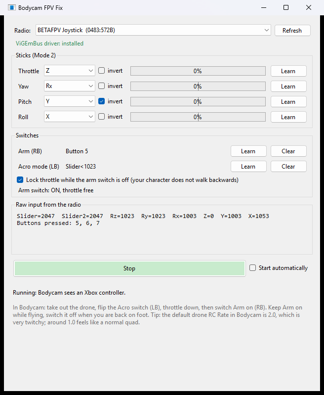

# Guide: flying the Bodycam drone with an RC radio

This guide takes you from a new radio to the first flight. It takes about five minutes.

## 1. Connect the radio

1. Switch the radio on and connect it to the PC with a USB data cable (some cheap cables only charge).
2. If the radio shows a menu for the USB mode (EdgeTX, OpenTX), choose **USB Joystick (HID)**. A BETAFPV LiteRadio does this by itself.

Windows now lists the radio as a game controller. You can check this with `Win + R` → `joy.cpl`.

## 2. Start Bodycam FPV Fix

1. Download `BodycamFpvFix.exe` from the [latest release](https://github.com/lukas-Logikfabrik/bodycam-fpv-fix/releases/latest) and start it.
2. If Windows SmartScreen warns about an unknown app, click **More info → Run anyway**. The exe is not code-signed; you can check where it came from with `gh attestation verify` (see the [README](../README.md#is-this-safe-to-run)).
3. Your radio should be selected at the top. If not, pick it from the list or click **Refresh**.

### The driver (only the first time)

The virtual Xbox controller needs the free **ViGEmBus** driver. If it is missing, the program shows **Install driver (one admin prompt)**:

1. Click the button. The program downloads the official installer and checks it.
2. Confirm the Windows admin prompt and click through the installer.
3. The line turns green: *ViGEmBus driver: installed*. If not, restart Windows once.

## 3. Check the sticks

Move each stick and watch the bars:

| Row | Stick (Mode 2) | Bar should go |
|---|---|---|
| Throttle | left stick up/down | 0 % at the bottom, 100 % at the top |
| Yaw | left stick left/right | right = plus |
| Pitch | right stick up/down | up (forward) = plus |
| Roll | right stick left/right | right = plus |

If a bar moves with the wrong stick or the wrong way:

1. Click **Learn** in that row.
2. Do what the blue text says (for example *Push the RIGHT stick fully UP and hold it*) and hold the stick for a moment.
3. The row now shows the right axis, and **invert** is set as needed.

The grey box *Raw input from the radio* shows every axis and button the radio sends. It helps when something does not react at all.

## 4. Set the two switches

| Function | What it does in Bodycam |
|---|---|
| **Arm (RB)** | Arms the drone. While the switch is off, the throttle is held at center so your character does not walk backwards. |
| **Acro mode (LB)** | Bodycam toggles Acro mode with LB. Each flip of this switch is one press. |

For each one: click **Learn**, then flip the switch you want (for Arm: flip it to the **on** position). The line shows the learned input, for example `Button 5` or `Slider<1023`. **Clear** removes it again.

## 5. Start

Click **Start**. The status line says *Running: Bodycam sees an Xbox controller.* and the button turns green.

Keep your sticks still for the first two seconds: the program measures the stick centers. If a stick is far off center, a red warning appears. Then calibrate the radio and click Stop and Start.

Leave the window open while you play. You can minimize it. If you unplug the radio, the program waits and reconnects by itself.

Tick **Start automatically** to skip the Start click next time.

## 6. Fly in Bodycam

1. Take out the drone from the tablet.
2. Flip the **Acro** switch. Only Acro mode uses the four sticks like a real quad. In Bodycam's normal mode the left stick moves forward and back and the right stick moves the camera.
3. Throttle all the way down.
4. Switch **Arm** on and fly. Keep Arm on during the flight.
5. After the flight (or a crash) switch Arm off again. For the next drone, start at step 2.

### Rates

Bodycam's default drone rates are very high. In **Settings → Drone** try RC Rate **1.0**, Super Rate **0.65**, Expo **0.15** and camera tilt **25°**.

## Problems

See [Troubleshooting](../README.md#troubleshooting) in the README.
